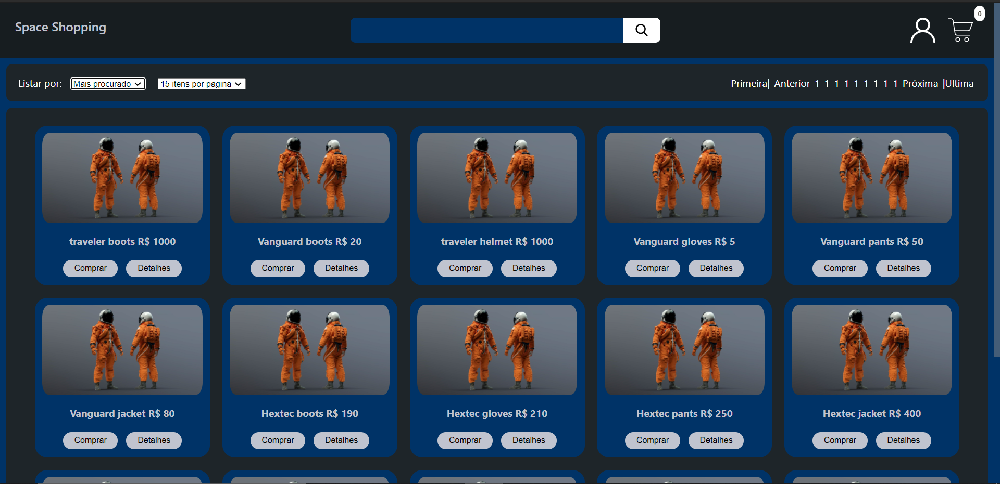
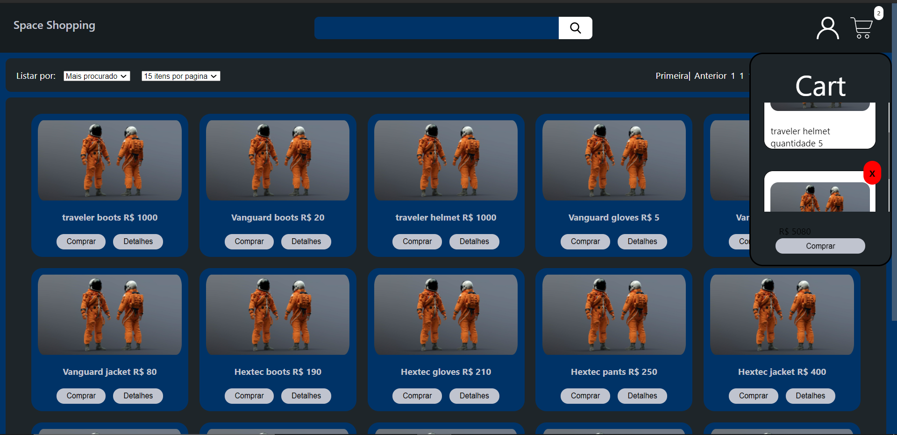

# SpaceShopping
This project is a personal project with React framework. The website was made using <a href="https://github.com/css-modules/css-modules.git">Css  modules</a> and Context, i love every second work in this project if you have something to add feel free to open a request.
# How to use it
1 - you need to have <a href="https://nodejs.org/pt-br/">NodeJs</a> 10.16 our higher and npm.
 
2 - npx create-react-app my-app to create the application.
 
cd my-app to enter in the directory.
 
npm start to start the application.
 
3 - start to code in app.js.
 
Any help you need to start coding javaScript in React <a href="https://reactjs.org/docs/create-a-new-react-app.html">React documentation</a>
 
Website link: http://obscene-paper.surge.sh/

